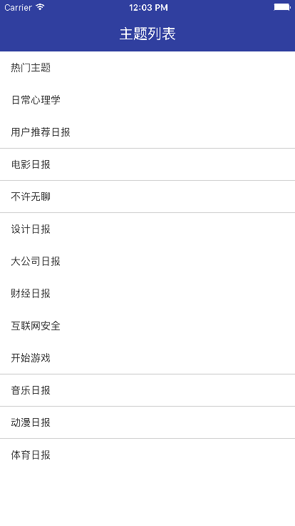

# XiaoxiaZhihuRN

---

参考知乎日报，使用网络上的[Api](https://github.com/izzyleung/ZhihuDailyPurify/wiki/%E7%9F%A5%E4%B9%8E%E6%97%A5%E6%8A%A5-API-%E5%88%86%E6%9E%90)，仿写了一个知乎日报客户端。

由于使用非正常手段获取Api，若被告知需停止共享与使用，本人会及时删除此页面与整个项目。

本项目使用React Native进行开发

## 其他客户端

[XiaoxiaZhihu iOS客户端](https://github.com/LiushuiXiaoxia/XiaoxiaZhihu_iOS)

[XiaoxiaZhihu Android客户端Java版本](https://github.com/LiushuiXiaoxia/XiaoxiaZhihu)

[XiaoxiaZhihu Android客户端Kotlin版本](https://github.com/LiushuiXiaoxia/XiaoxiaZhihu_Kotlin)

[XiaoxiaZhihu客户端ReactNative版本](https://github.com/LiushuiXiaoxia/XiaoxiaZhihuRN)

[XiaoxiaZhihu客户端Weex版本](https://github.com/LiushuiXiaoxia/XiaoxiaZhihuWeex)

## 效果图





## 使用

### 目录介绍

```
|--XiaoxiaZhihuRN
    |-- android // andorid code
    |-- ios // andorid code
    |-- node_module // node_module code
    |-- React // React Native
        |-- data // http api
        |-- native // android native bridge
        |-- ui // react naive ui page
        |-- util // util
        |-- widget // custom widget
            |-- native widget//
```

### 如何启动React Native

```shell
cd React
npm install
npm start
```
### 如何启动Android 

```shell
./gradew installDebug
```

## 修改记录

### v0.0.3
 * 使用redux模式 

### v0.0.2
 * 支持iOS
 * banner轮训支持iOS


### v0.0.1
 * 完成基本功能


## 后续优化
* banner轮训问题
* WebView与ScrollView兼容问题
* ToolbarAndroid做成平台无关性
* 性能优化
